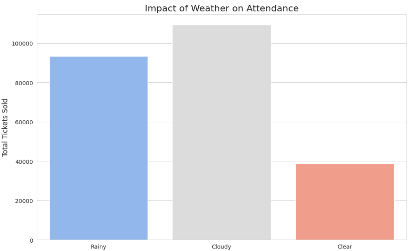
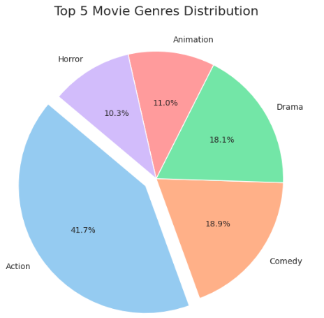
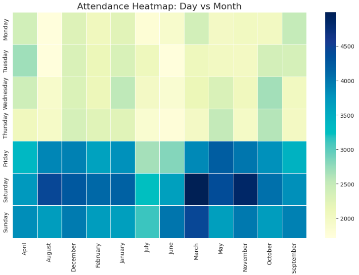
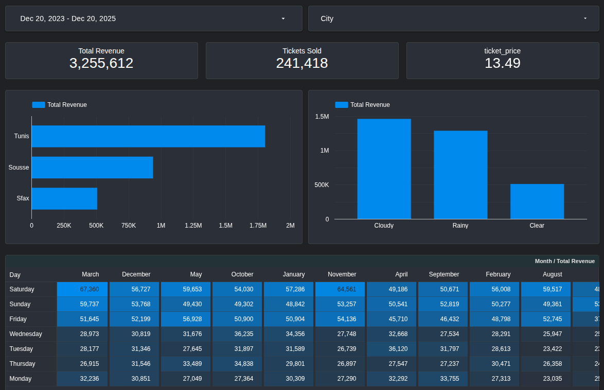
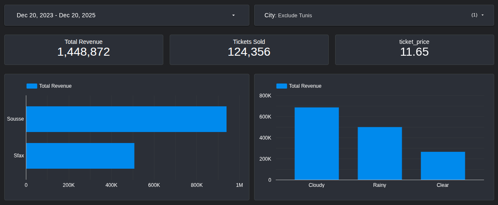

# 🎬 **CinéInsights: Cinema Analytics Data Warehouse**

Welcome to **CinéInsights** — a full-stack, cloud-ready analytics solution for cinema operations in Tunisia. This project simulates, processes, and analyzes movie ticket sales, customer demographics, weather impacts, and more, all orchestrated via interactive Google Colab notebooks.

---

## 📦 **Project Structure**

```
CineInsights/
│
├── notebooks/
│   ├── 1_data_preparation.ipynb
│   ├── 2_source_simulation.ipynb
│   ├── 3_etl_pipeline.ipynb
│
├── sql/
│   ├── source_schema.sql
│   ├── dw_schema.sql
│
├── filtered_tmdb_movies_sample.csv
├── tunisia_historical_weather.csv
│
└── README.md
```

---

## 🚀 **Quick Start (Google Colab)**

> **Note:** All steps are performed in Google Colab. No local setup required!

### 1️⃣ **Data Preparation**

- **Notebook:** `1_data_preparation.ipynb`
- **Purpose:** Download, filter, and sample movie data from Kaggle. Fetch historical weather data for Tunisian cities.

#### **Steps:**
1. **Open** the notebook in Colab.
2. **Upload** your `kaggle.json` API key when prompted.
3. **Run all cells** sequentially:
   - Downloads TMDB movie dataset.
   - Filters for recent, popular, and high-revenue movies.
   - Samples 200 movies for simulation.
   - Fetches weather data for Tunis, Sousse, and Sfax.
   - Saves outputs:  
     - `filtered_tmdb_movies_sample.csv`  
     - `tunisia_historical_weather.csv`

---

### 2️⃣ **Source System Simulation**

- **Notebook:** `2_source_simulation.ipynb`
- **Purpose:** Simulate daily ticket sales and customer profiles using business logic (weighted by city, day, weather, movie rating).

#### **Steps:**
1. **Open** the notebook in Colab.
2. **Run all cells**:
   - Generates synthetic customer and sales data.
   - Uploads data to a PostgreSQL database (Google Cloud SQL recommended).
   - Verifies data integrity and business logic via SQL queries.

---

### 3️⃣ **ETL Pipeline & Data Warehouse**

- **Notebook:** `3_etl_pipeline.ipynb`
- **Purpose:** Extract, transform, and load data into a star-schema data warehouse. Analyze KPIs and visualize insights.

#### **Steps:**
1. **Open** the notebook in Colab.
2. **Run all cells**:
   - Cleans and loads movie and weather data.
   - Builds dimension and fact tables in the data warehouse.
   - Loads all data using optimized bulk operations.
   - Runs health checks and generates dashboards.

---

## 📊 **Sample Visualizations**

### **Impact of Weather on Attendance**


### **Top 5 Movie Genres Distribution**


### **Attendance Heatmap: Day vs Month**


---

## 🏗️ **Architecture Overview**

- **Source System:** Simulated transactional data (customers, sales, theaters).
- **Data Warehouse:** Star schema (Fact_Ticket_Sales + Dimensions: Date, Movie, Theater, Customer, Weather).
- **ETL:** Python (pandas, pygrametl) in Colab, bulk loading to PostgreSQL.
- **Analysis:** SQL + Python (seaborn, matplotlib) dashboards.

---

## ⚙️ **Requirements**

- **Google Colab** (recommended for all notebooks)
- **Kaggle API Key** (`kaggle.json`)
- **Google Cloud SQL** (PostgreSQL instance)
- **Python Libraries:**  
  - pandas, numpy, sqlalchemy, psycopg2-binary  
  - pygrametl, seaborn, matplotlib  
  - faker (for simulation)  
  - missingno, fuzzywuzzy (for cleaning)

> All dependencies are installed automatically in the notebooks.

---

## 🌍 **Business Logic Highlights**

- **Weighted Cities:** Tunis > Sousse > Sfax (traffic, pricing, capacity)
- **Weighted Days:** Friday/Saturday/Sunday = peak sales
- **Weather Impact:** Rainy/Cold boosts cinema attendance; Hot/Clear reduces it
- **Price Elasticity:** Higher-rated movies command premium prices
- **Demographics:** Genre-driven customer profiles (age, gender)

---

## 📝 **Usage Tips**

- **Always run notebooks in order:**  
  1. Data Preparation  
  2. Source Simulation  
  3. ETL & Analysis
- **Replace database credentials** in each notebook with your own Cloud SQL details.
- **Download outputs** as needed for further analysis or backup.

---

## 💡 **Customization**

- **Change simulation parameters** (number of movies, cities, date range) in the notebooks.
- **Extend business logic** for new cities, genres, or pricing strategies.
- **Add new KPIs** by modifying SQL queries and dashboard cells.

---

## 📈 **Build an Interactive BI Dashboard in Google Looker Studio**

---

### **Step 1: Connect Looker Studio to your Data Warehouse**

1.  Open [Google Looker Studio](https://lookerstudio.google.com/).
2.  Click **Create** -> **Data Source**.
3.  Select **PostgreSQL**.
4.  **Configure the Connection:**
    *   **Host Name:** Your Google Cloud SQL Public IP.
    *   **Port:** `5432`
    *   **Database:** `postgres`
    *   **Username:** `postgres`
    *   **Password:** Your Password.
5.  **Authenticate:** Click "Authenticate".
6.  **Select Table:**
    *   Choose the **Custom Query** option (Best practice for Star Schemas in Looker).
    *   Paste this "Master Query" which joins everything for you. This makes dragging and dropping much easier.

```sql
SELECT 
    f.transaction_id,
    f.ticket_price,
    f.total_amount,
    f.quantity,
    
    -- Date Dimension
    d.full_date,
    d.day_name,
    d.month_name,
    d.year,
    d.is_weekend,
    
    -- Movie Dimension
    m.title as movie_title,
    m.primary_genre,
    m.vote_average,
    m.runtime_category,
    
    -- Theater Dimension
    t.city,
    t.theater_name,
    
    -- Customer Dimension
    c.gender,
    c.age_group,
    
    -- Weather Dimension
    w.weather_state,
    w.temp_category

FROM dw.Fact_Ticket_Sales f
JOIN dw.Dim_Date d ON f.date_key = d.date_key
JOIN dw.Dim_Movie m ON f.movie_key = m.movie_key
JOIN dw.Dim_Theater t ON f.theater_key = t.theater_key
JOIN dw.Dim_Customer c ON f.customer_key = c.customer_key
JOIN dw.Dim_Weather w ON f.weather_key = w.weather_key
```
7.  Click **Connect**.
8.  **Type Check:** Ensure `total_amount` is a **Currency (TND)** and `transaction_id` is a **Number**. Click **Create Report**.

---






## 📚 **References**

- [TMDB Movies Dataset (Kaggle)](https://www.kaggle.com/datasets/asaniczka/tmdb-movies-dataset-2023-930k-movies)
- [Open-Meteo API](https://open-meteo.com/)
- [Google Cloud SQL](https://cloud.google.com/sql/docs/postgres)

---

## 🏆 **Contact & Credits**

Developed by Khaled for advanced analytics and data warehousing education.

---

